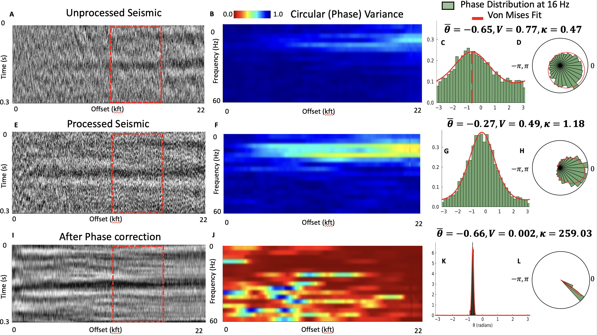

# Data-Driven Analysis of Seismic Phase Using Circular Statistics

[](https://pubs.geoscienceworld.org/seg/tle/article/44/9/683/660917/Data-driven-analysis-of-seismic-phase-using)
[](Data%20driven%20analysis%20of%20seismic%20phase%20using%20circular%20statistics.pdf)
[](code.pdf)
[](notebook.jl)
[](https://julialang.org/)
[](https://doi.org/10.5281/zenodo.20045225)

**Rohatgi, A., Bakulin, A., and Fomel, S. (2025)**
*The Leading Edge*, 44(9), 683–691

---

## Overview

Recognizing seismic phase as a primary attribute in seismic processing workflows, we apply circular statistics, a robust data-driven approach for correcting phase distortions in prestack seismic data. Unlike traditional linear methods that struggle with wrapped phase and often defer phase diagnostics to the final processing stages, the proposed approach treats phase as a circular variable. We compute the circular mean, variance, and von Mises concentration parameter directly from phase ensembles in the frequency domain. These parameters provide insights into phase stability and coherence without needing phase unwrapping or wavelet assumptions. Synthetic tests using additive and multiplicative noise models confirm that phase distributions follow the von Mises distribution, an analog of the normal distribution for circular variables, with circular statistics reliably tracking the true phase even in low-signal-quality scenarios. Field examples demonstrate how this framework can map phase behavior across frequency and offset, enabling the detection of coherence bands and assessing the impact of each processing step on phase fidelity. The proposed approach can be particularly valuable in land acquisition, where prestack data often exhibit a low signal-to-noise ratio. Circular statistics allow us to evaluate phase integrity at each frequency, facilitating novel data conditioning and acquisition design strategies.

<p align="center">
  
</p>


## Repository Contents

| File | Description |
|------|-------------|
| `Data driven analysis of seismic phase using circular statistics.pdf` | Published paper |
| `code.pdf` | Complete code associated with the paper |
| `notebook.jl` | Reproducible Pluto notebook |

---

## Getting Started

### Prerequisites

- [Julia](https://julialang.org/downloads/) (≥ 1.9 recommended)

### Install Pluto

Launch Julia and install the Pluto package:

```julia
using Pkg
Pkg.add("Pluto")
```

### Run the Notebook

```bash
# Clone the repository
git clone https://github.com/arohatgi29/SeismicPhaseAnalysis.git
cd SeismicPhaseAnalysis.git
```

From the Julia REPL:

```julia
using Pluto
Pluto.run(notebook="notebook.jl")
```

This will open the Pluto notebook in your browser. Any dependencies used in the notebook will be installed automatically by Pluto's built-in package manager.

---

## Citation

If you use this work, please cite:

```bibtex
@article{rohatgi2025phase,
  title   = {Data-driven analysis of seismic phase using circular statistics},
  author  = {Rohatgi, A. and Bakulin, A. and Fomel, S.},
  journal = {The Leading Edge},
  volume  = {44},
  number  = {9},
  pages   = {683--691},
  year    = {2025},
  doi     = {10.1190/tle44090683.1}
}
```

---

## License

The code in this repository is released under the MIT License. Data, figures, and manuscript PDFs may be subject to separate copyright or data-owner restrictions.

---

## Contact

For questions or feedback, please open an [issue](../../issues) or email [akshikarohatgi@utexas.edu](mailto:akshikarohatgi@utexas.edu).
