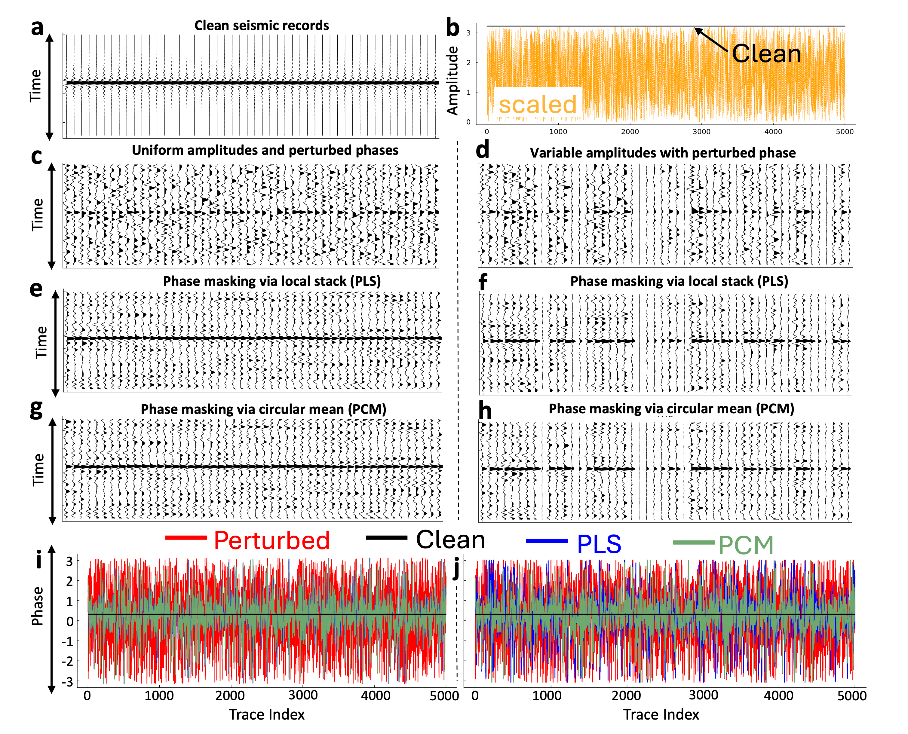
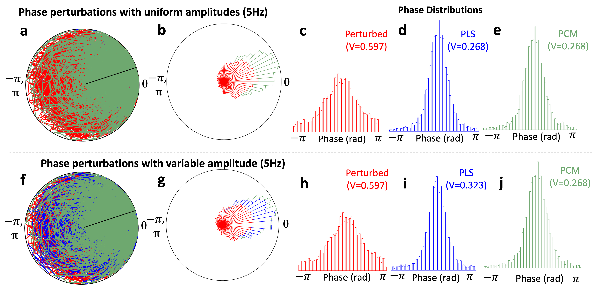

# Amplitude-Invariant Phase Masking for Coherence Recovery in Scattered Wavefields

[](Preprint.pdf)
[](code.pdf)
[](notebook.jl)
[](https://julialang.org/)

**Akshika Rohatgi¹, Andrey Bakulin¹, and Sergey Fomel¹ (2026)**  
*Submitted to Journal of the Acoustical Society of America*

¹ Bureau of Economic Geology, University of Texas at Austin, Austin, Texas 78758, United States

---

## Overview

<p align="center">
  
  <br>
</p>

Coherent summation of multichannel recordings relies on phase stability across measurements. In scattered wavefields, near-surface heterogeneities introduce record-dependent phase distortions that decorrelate otherwise coherent signals and degrade summation quality. Conventional approaches to recovering phase coherence implicitly tie phase estimation to signal amplitude, introducing bias where amplitude variability is large.

We present a framework based on circular statistics that separates phase estimation from amplitude entirely, ensuring all records contribute equally to the representative phase regardless of their energy. The key contribution is **phase masking via the circular mean (PCM)**, which normalizes spectra to unit magnitude prior to averaging, decoupling phase estimation from amplitude by construction.

Synthetic experiments confirm that PCM outperforms conventional phase masking via local stack (PLS) when amplitude variability is present, offering a practical path toward more robust coherence recovery in seismic imaging and other wave-based sensing applications.

---

## Result

<p align="center">
  
  <br>
  <em>Phase variance spectra before and after phase masking under uniform and variable amplitude conditions. PCM maintains consistently lower phase variance than PLS when amplitude variability is present.</em>
</p>

---

## Repository Contents

| File | Description |
|------|-------------|
| `Preprint.pdf` | Preprint of the paper |
| `code.pdf` | Complete code associated with the paper |
| `notebook.jl` | Reproducible Pluto notebook |

---

## Getting Started

### Prerequisites

- [Julia](https://julialang.org/downloads/) (≥ 1.9 recommended)

### Install Pluto

Launch Julia and install the Pluto package:

```julia
using Pkg
Pkg.add("Pluto")
```

### Run the Notebook

```bash
# Clone the repository
git clone https://github.com/TCCS-CODES/Rohatgi-etal-seismic-phase-masking.git
cd Rohatgi-etal-seismic-phase-masking.git)
```

From the Julia REPL:

```julia
using Pluto
Pluto.run(notebook="notebook.jl")
```

This will open the Pluto notebook in your browser. Any dependencies used in the notebook will be installed automatically by Pluto's built-in package manager.

---

## License

Please refer to the paper and journal for terms of use.

---

## Contact

For questions or feedback, please open an [issue](../../issues) or email [akshikarohatgi@utexas.edu](mailto:akshikarohatgi@utexas.edu).
